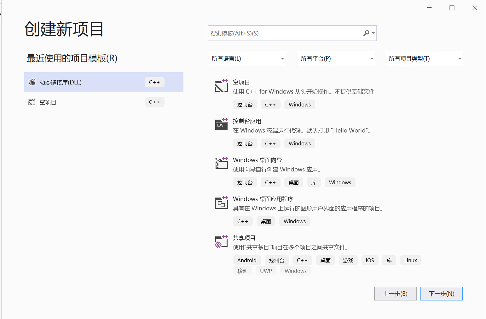
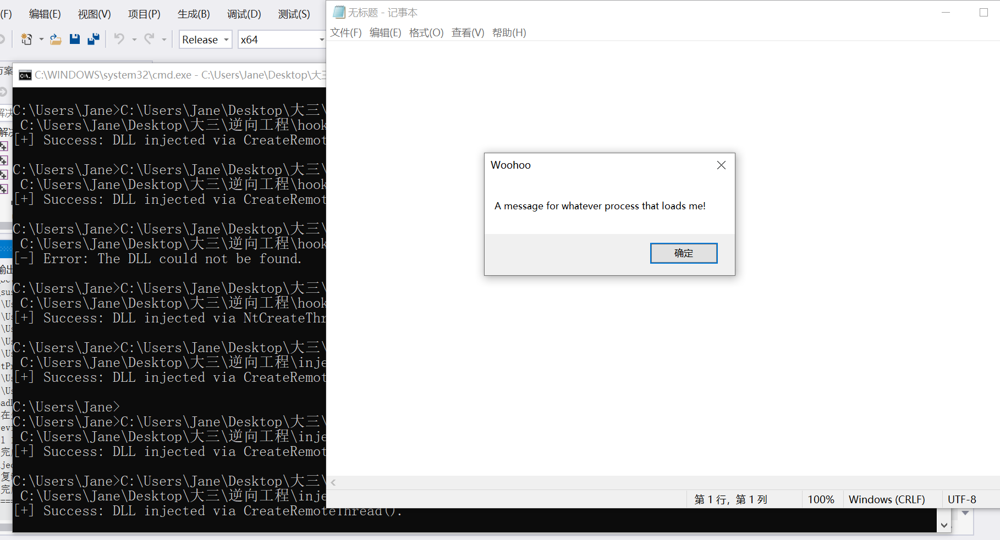

## DLL注入任何程序，改程序的行为

#### 实验环境

- Visual Studio 2019
- Windows 10

#### 主要参考

- [Github injectAllTheThings](https://github.com/fdiskyou/injectAllTheThings)

#### 实验过程

1. 观察如何得到DLL

   - VS2019新建一个DLL空项目

     

   - 默认生成dll是通过DLLMain这个函数的

     这个DLL入口函数：[参考](https://www.cnblogs.com/jack-jia-moonew/p/4220696.html)

     ```c++
     BOOL APIENTRY DllMain( HMODULE hModule,
                            DWORD  ul_reason_for_call,
                            LPVOID lpReserved
                          )
     {
         switch (ul_reason_for_call)
         {
         case DLL_PROCESS_ATTACH:
         case DLL_THREAD_ATTACH:
         case DLL_THREAD_DETACH:
         case DLL_PROCESS_DETACH:
             break;
         }
         return TRUE;
     }
     ```

     可以在四个不同的case下加入不同的执行动作，然后**重新生成解决方案**，在工程目录下就能找到用来注入正常程序的**.dll**文件

2. 利用开源项目[Github injectAllTheThings](https://github.com/fdiskyou/injectAllTheThings)注入

   - git clone https://github.com/fdiskyou/injectAllTheThings.git

   - 打开解决方案，观察项目结构

   - 通过试验发现改动dllproc.cpp里的DLLMain()可以在injectAllTheThings\x64\Release里生成需要的dllproc.dll

   - 改动dllproc.cpp里的DLLMain()

     ```c++
     #include <windows.h>
     #include <stdio.h>
     BOOL APIENTRY DllMain(HMODULE hModule, DWORD  ul_reason_for_call, LPVOID lpReserved)
     {
     	switch (ul_reason_for_call)
     	{
     	case DLL_PROCESS_ATTACH:
     		MessageBoxA(NULL, "A message for whatever process that loads me!", "Woohoo", 0);
     		break;
     	case DLL_PROCESS_DETACH:
     		break;
     	case DLL_THREAD_ATTACH:
     		break;
     	case DLL_THREAD_DETACH:
     		break;
     	}
     	return TRUE;
     }
     ```

   - 重新生成该项目，找到新生成的dllproc.dll

   - 将dllproc.dll注入到notepad.exe

     ```text
     injectAllTheThings\x64\Release\injectAllTheThings.exe -t 1 notepad.exe injectAllTheThings\x64\Release\dllpoc.dll
     ```

     参考的项目说明：

     ```
     C:\Users\rui>injectAllTheThings_64.exe
     injectAllTheThings - rui@deniable.org
     Usage: injectAllTheThings.exe -t <option> <process name> <full/path/to/dll>
     Options:
       1     DLL injection via CreateRemoteThread()
       2     DLL injection via NtCreateThreadEx()
       3     DLL injection via QueueUserAPC()
       4     DLL injection via SetWindowsHookEx()
       5     DLL injection via RtlCreateUserThread()
       6     DLL injection via Code Cave SetThreadContext()
       7     Reflective DLL injection
     ```

3. 注入结果

   

#### 附录

- 不让上传一个工程，所有代码文件请见injectAllTheThings文件夹